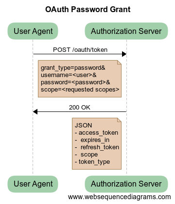

## OAuth2 Password Grant

This grant type exchanges a username and password for an access token. It
should only be used where the application is absolutely trusted with user
credentials.

Avoiding handing over credentials to a third party is the problem that OAuth
exists to solve. Therefore this grant type should only be used in a first party
scenario i.e. where the application and the resource server are owned by the
same organisation.

